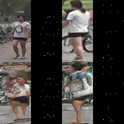

## Getting Started

This project is a reproduction of original [CSquareGAN](https://arxiv.org/pdf/1908.00999.pdf). The original version is not available in open source.
The key idea here is to form two cycles of GANs. The first one uses pose keypoints from one pedestrian image and different pedestrian image (of the same ID) to reconstruct image with given pose and reconstruct target keypoints. The second uses reconstructed data to generate the source data (source image and keypoints).




### Installing

Use sv_env.yml to create conda evironment 

```
conda env create -f sv_env.yml
```

## Usage

```
python train.py configs/config_1.yml
```

Look the results in the `session_name` (from config) folder. To understand config files contact me.
